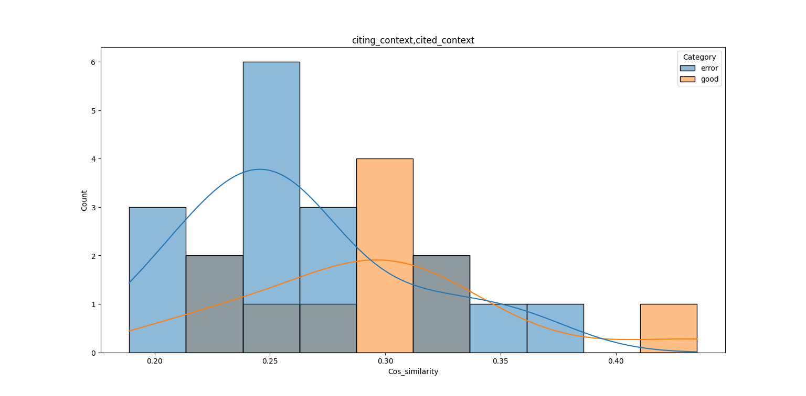
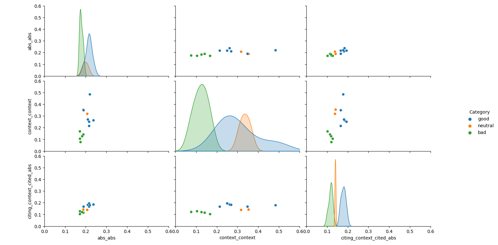
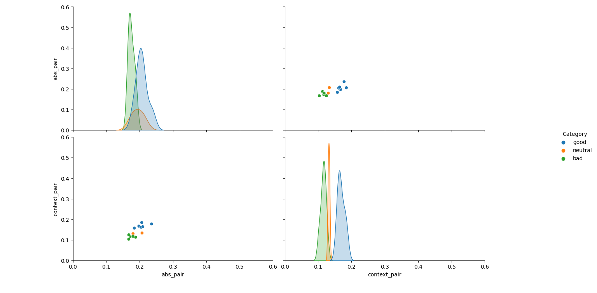

# citation_check
a little plateform for citation accuracy checking using embeddings and cos-similarity as a metric

#### A small tutorial
**Arguments**
- --f_in: *required*, path of the input file, under a format of .csv and separated by \t
- --f_out: *required* path of the output file
- --max_size: max size of the bert tokens, 128 by default
- --model: models for the treatment. enter 1 for bert and 0 for sci-bert
- --mode: the comparision mode, all, pair or modes separated by ","
- --plot: enter 1: do a plot, 0: no plot

**Examples**

```powershell
python3 main.py --f_in 'similar_citations.csv' --f_out 'output/bert/bert_c_abs_simi.csv' --max_size '512' --plot '1' --mode 'citing_context,cited_context' --model '1'
```
This means, we use bert model to deal with the citations in *mis_cite.csv*, with 512 as max size of the tokens. We compare the cosine similarity of the contexts of citing papers and contexts of the cited paper , and we output the result to *output/bert/bert_cc_simi.csv* and do a plot.



```powershell
python3 main.py --f_in 'mis_citations.csv' --f_out 'output/bert/all.csv' --max_size '512' --plot '1' --mode 'all' --model '1'
```
In this **'all'** mode, we can obtain the similarities of **context** of citing paper vs **context** of cited paper, **context** of citing paper vs **abstract** of cited paper and **abstract** of citing paper vs **abstract** of cited paper. In the end, we can get a pairplot.


```powershell
python3 main.py --f_in 'mis_citations.csv' --f_out 'output/bert/bert_pair.csv' --max_size '512' --plot '1' --mode 'pair' --model '1'
```
In this **'pair'** mode, we can obtain the similarities of context of citing paper vs a phrase pair of : context and abstract of cited paper. In the end, we can get a pairplot.
